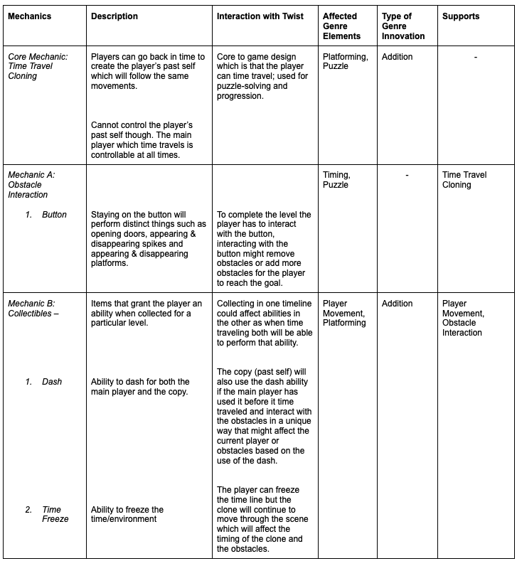
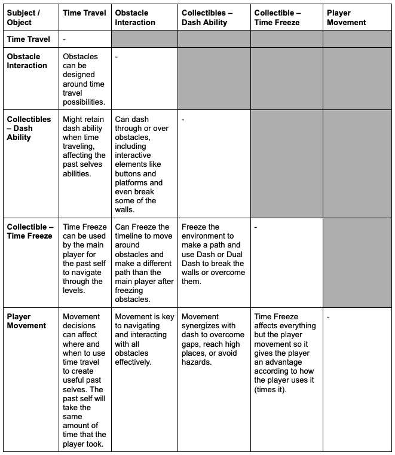
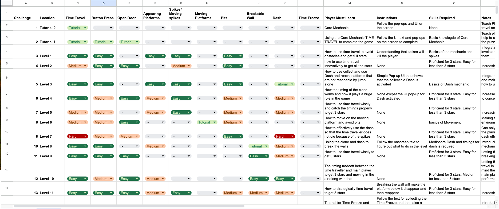
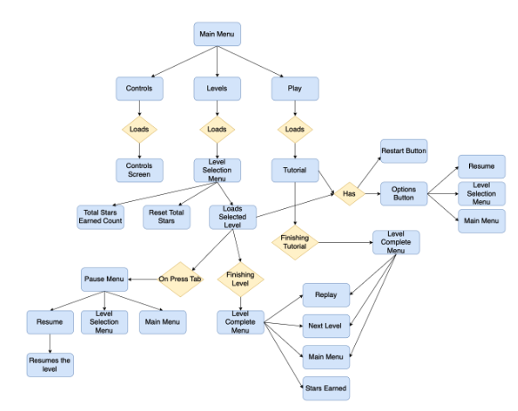
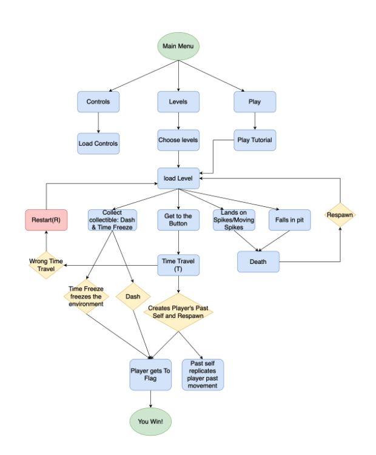
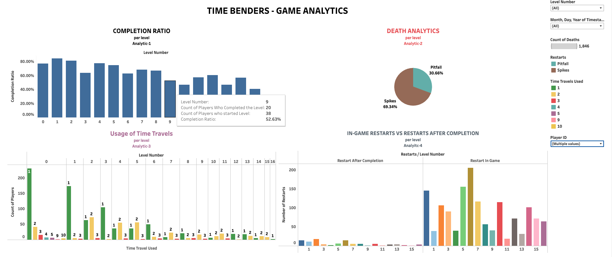

# Me, Myself and Time (Unity 2d Game)

This is a semester long project (game) for my graduate level class "CSCI 526 Advance Mobile Devices and Game Consoles" Me, Myself and Time at University of Southern California (USC) under Professor Scott Easley.

# Appendix

### Introduction
**Me, Myself, and Time** is a 2D platformer game developed over a semester-long and a 6-month project. The game features a unique time-traveling mechanic that allows players to use their past selves to navigate through challenging levels filled with obstacles, collectibles, and strategic challenges.

### Features
- **Time-traveling mechanic:** Use your past self to assist in navigating through levels.
- **Challenging levels:** Increasing difficulty with new objects and obstacles such as spikes, pits, moving platforms, and disappearing platforms.
- **Collectibles:** Special abilities like dash and time freeze.
- **Star rating system:** Based on the number of time travels used.
- **Comprehensive analytics:** Detailed game analytics including heatmaps and Sankey diagrams.

### Core Mechanics
#### Time Travel
- The main player can travel back in time and see the actions of their past self.
- Limited to 3 time travels per level to increase the challenge.
- Every move must be strategically planned as more time travels result in fewer stars.

#### Obstacles and Challenges
- **Spikes:** Immediate death upon contact.
- **Pits:** Falling into a pit results in immediate death and level restart.
- **Moving and disappearing platforms:** Require precise timing and coordination with past self.

#### Collectibles
- **Dash Collectible:** Allows the player to dash to reach otherwise unreachable places.
- **Time Freeze Collectible:** Freezes everything except the player and their future self, aiding in avoiding obstacles and completing the level.

#### Star System
- Stars are awarded based on the number of time travels used.
- Visible star indicators help players understand when they start losing stars.

### Game Design Document
For a comprehensive overview of the research, game design, single mechanic challenge matrix, twist vs tropes matrix, mechanics, analytics and much more, refer to our [Game Design Document (GDD)](https://docs.google.com/document/d/1MNr_Zmwyp7lDJeMD5oJkf1L4IcIG-hcOj8F7p1cGsj8/edit).


## Installation

### Prerequisites
- Unity 2022.3.17f1 or later.

### Steps
1. **Clone the repository:**
    ```bash
    git clone https://github.com/bhuvannnn/Me-Myself-and-Time.git
    ```

2. **Open the project in Unity:**
    - Open Unity Hub.
    - Click on "Add" and select the cloned project directory.

3. **Install required packages:**
    - Open the Package Manager in Unity (Window > Package Manager).
    - Ensure all required packages are installed.

## Usage
1. **Play the game:**
    - Open the Unity Editor.
    - Click on the "Play" button to start the game.

2. **Build the game:**
    - Open the Build Settings (File > Build Settings).
    - Select the target platform and click "Build".
    
## Analytics
We have implemented extensive analytics to track player behavior and game performance. This includes:
- Unique player IDs and build versions.
- Detailed tracking of deaths by spikes, pits, etc.
- Number of time travels used per level.
- In-game restarts vs. restarts after level completion.
- Heatmaps and Sankey diagrams to visualize player paths and behaviors.

### Tableau Dashboard
- [View the live Tableau dashboard](https://public.tableau.com/app/profile/dattateja.reddy.anakala2291/viz/GameAnalytics_17096239822570/Dashboard1)

## Screenshots







[Mechanic Challenge Matrix spreadsheets](https://docs.google.com/spreadsheets/d/1n1cbXQwXf2db0UWdz5ObMwByCyKDhTjp0O1Vkzg5oFU/edit?gid=0#gid=0)








## Documentation

### Game Design Document
For a comprehensive overview of the research, game design, single mechanic challenge matrix, twist vs tropes matrix, mechanics, analytics and much more, refer to our [Game Design Document (GDD)](https://docs.google.com/document/d/1MNr_Zmwyp7lDJeMD5oJkf1L4IcIG-hcOj8F7p1cGsj8/edit).


## Acknowledgements

We would like to thank our professor, Scott Easley, and the teaching staff for their support and feedback throughout this project. A huge shoutout to my team Ashley, Rahul, Sihan, Dattateja and Hinal for pulling this off with me.

